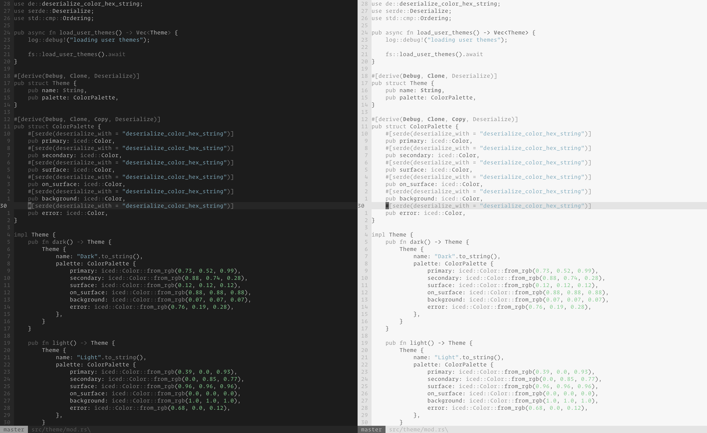

# Sort/Hvid

Sort/Hvid is a Vim theme with barely any colors.
It is heavily inspired by [Yin/Yang](https://github.com/pgdouyon/vim-yin-yang/) and [Meh](https://github.com/davidosomething/vim-colors-meh).



## Installation

Copy the files to the appropriate directories in `~/.vim/`, or use a plugin manager like
[vim-plug](https://github.com/junegunn/vim-plug), e.g.

```viml
Plug 'casperstorm/sort-hvid.vim'
colorscheme sort
```

## License

Ajour is released under the [MIT License.](./LICENSE)
